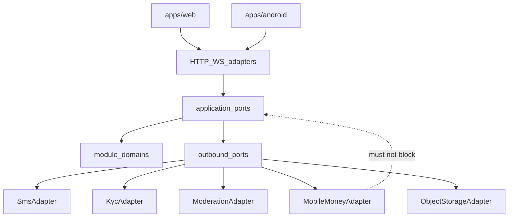
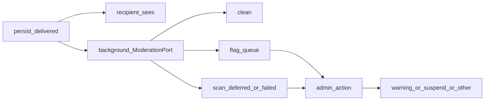
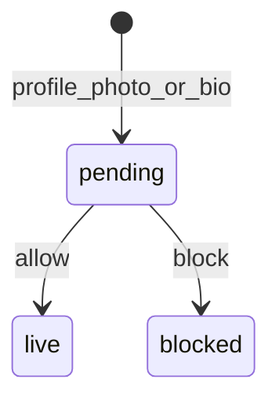
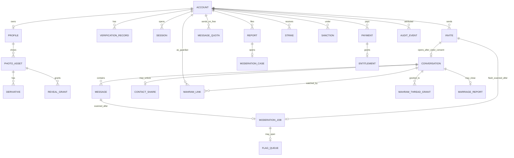
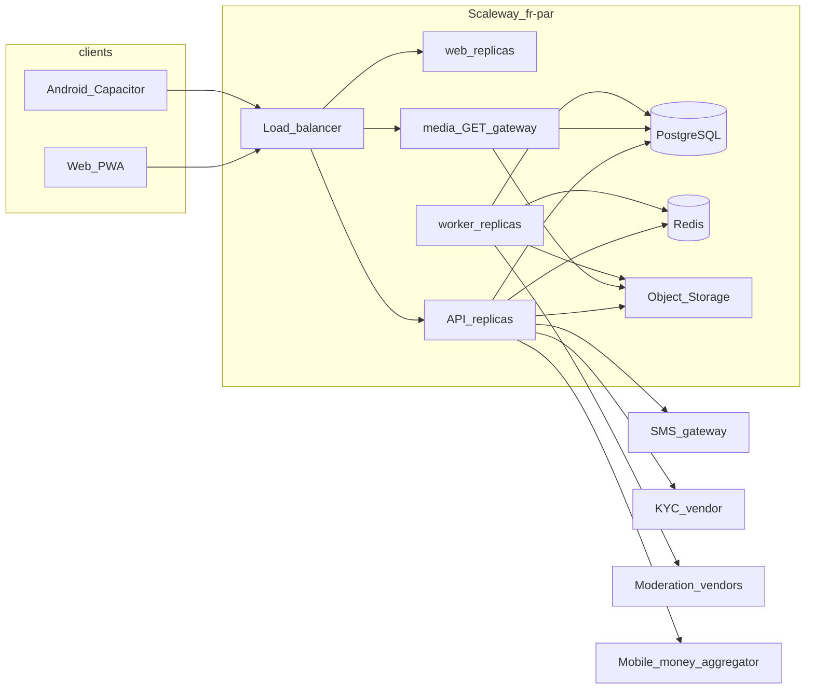

# Architecture Spine — muslim-marriage-africa

Working title **muslim-marriage-africa**. Product name undecided (shortlist Nisfuddin — also consider `nisfdin` — Nikahsira, Sakinaa; alternates Mithaqun, Nonglem). RDAP checks are point-in-time, not a purchase. Assumptions A1–A3 stay as written in the brief/PRD.

## Design Paradigm

**Hexagonal modular monolith.** One API *product* from one image: `api` + `worker` process roles (AD-1), plus an in-region `web` role (AD-4). Each capability is a module with `domain` + `application` + inbound/outbound **ports**; vendor I/O lives only in **adapters**. The Next.js/Capacitor clients are a single UI shell that talks HTTP+WebSocket — they do not own invariants.

| Layer | Lives in |
| --- | --- |
| UI shell | `apps/web` (Next.js PWA) + `apps/android` (Capacitor wrapper) |
| Inbound adapters | `apps/api` HTTP/WS controllers, webhook receivers |
| Application + domain | `modules/<name>/{application,domain}` |
| Outbound adapters | `modules/<name>/adapters/*` (SMS, KYC, moderation vendors, S3, mobile-money) |
| Shared kernel | `packages/kernel` (IDs, error envelope, auth context, clocks) |

## Invariants & Rules

### AD-1 — Hexagonal modular monolith

- **Binds:** all
- **Prevents:** a microservice mesh at Burkina-launch scale, or a layered dump with no vendor ports
- **Rule:** ship one API *product*. Two process roles from the **same image**: `api` (HTTP/WS) and `worker` (BullMQ processors). Modules contribute queue processors; they do not deploy their own queues or extra Deployments. A third in-region `web` role is AD-4. No per-module microservice

### AD-2 — Dependency direction

- **Binds:** all
- **Prevents:** circular module imports, domain depending on Nest/Next, billing outage leaking into safety paths, an absolute sister-invite `BillingPort` ban that blocks `same_quota_as_brothers`, or a Chat-send path that cannot read the FR-146 cap
- **Rule:** `clients → inbound adapters → application → domain`; modules call other modules only through published application ports, never tables; domain never imports adapters or frameworks. Identity, verification, media, moderation, mahram attach, report, block, browse/discovery, and Invite accept / `ChatPort.openFromInvite` must not import or call `BillingPort` (including `isEntitled`) in either `sister_reach_mode`. A Chat (or Flash / card quick-message) **send** must call `BillingPort.isEntitled` **only** to decide the FR-146 message cap (AD-21, AD-29) — never on Chat GET, list, typing, contact-share, or Socket.IO join. `ChatPort.consumeMessageQuota` is the only place Flash / card may cause that `isEntitled` read; invites still must not import `BillingPort` on Sister invite send when `free_unlimited` Sister invite send and Sister invite quota/compose still follow AD-27: may call `BillingPort.isEntitled` **only** when `operator_config.sister_reach_mode` is `same_quota_as_brothers`; when `free_unlimited` those Sister invite paths must not call `BillingPort`. Sister reach-pack catalog/checkout may call `BillingPort` in **both** `sister_reach_mode` values (AD-14, AD-29). Brother Invite quota and paid-faster-review may call `BillingPort.isEntitled` always — they never treat `sister_reach_mode` as a free pass



### AD-3 — Single entity ownership

- **Binds:** all modules
- **Prevents:** two writers of one entity (Profile, Message, PhotoGrant, Payment, Case)
- **Rule:** the owning module is the only writer; others store foreign keys and read through the owner's port

| Entity | Owner |
| --- | --- |
| account, credential, session, pin_lock, cookie_consent | identity |
| verification_record | verification |
| profile, profile_field, completeness | profiles |
| favourite, profile_visit | discovery |
| mahram_thread_grant | mahram |
| likeness_grant | media |
| invite, message_flash, invite_quota | invites |
| conversation, message, reaction, taaruf_stage, contact_share, message_quota | chat |
| photo_asset (kind `profile_photo\|chat_photo\|voice_note`), derivative, signed_grant, reveal_grant | media |
| moderation_job, flag_queue | moderation |
| mahram_invite, mahram_link, mahram_permission | mahram |
| report, moderation_case, strike, sanction, ban, appeal, block, fingerprint | trust |
| marriage_report, consent_story, marriage_counter | outcomes |
| pack, payment, entitlement, webhook_receipt | billing |
| article, board_member, locale_string, audio_asset, ice_breaker_template | content |
| operator_config, cil_ticket | operator |
| notification, sms_dispatch | notifications |
| audit_event | audit |

### AD-4 — One shared web UI plus Capacitor Android

- **Binds:** FR-132, FR-133, FR-134, FR-135, FR-020, FR-061, NFR-005
- **Prevents:** a second UI (RN/Expo or Flutter) or a TWA-only shell that cannot set `FLAG_SECURE` or reliable FCM/camera
- **Rule:** all member/mahram/moderator/operator screens ship from `apps/web`. That `web` process role runs **in `fr-par` on Kapsule** (Next.js Node). It must not import `modules/*/domain`. Vercel, Netlify, and any USA edge host are rejected for Member traffic (same reason as AD-5). Play listing is `apps/android` Capacitor wrapping the same origin; iOS is the same Capacitor project later. Installable PWA is that same origin

### AD-5 — Primary hosting Scaleway Paris `[ASSUMPTION — legal review]`

- **Binds:** A3, FR-120, NFR-002
- **Prevents:** silent USA-default hosting (Farata DPA lists Vercel/Neon USA as processors — Offered (seen) (legal text)) and an un-disclosed region
- **Rule:** primary region is Scaleway `fr-par` (Paris, France). Public privacy page discloses in French: « Données hébergées en région Île-de-France (France), prestataire Scaleway ». CIL filing for this cross-border transfer is a launch gate. A3 text is not rewritten. Stack stays portable (AD-6) so the same containers can move in-country if CIL requires. Compared and rejected as primary: Virtix Ouaga colo (no managed PG/Redis/S3; gov cloud is admin-only); Lagos colo (still a transfer; no hyperscaler); AWS `af-south-1` / Azure-GCP Johannesburg (higher Ouaga latency, weaker FR legal fit). Hyperscaler alt if Scaleway is blocked: AWS `eu-west-3` Paris, same disclosure pattern

### AD-6 — Portable substrate

- **Binds:** AD-5, NFR-004, NFR-008
- **Prevents:** lock-in to a vendor-only datastore that cannot move to Burkina colo
- **Rule:** OCI containers on Kubernetes; standard PostgreSQL; S3-compatible object storage; Redis (or Valkey-compatible) for queue/cache/pubsub; secrets in a secrets manager, never in images

### AD-7 — API style, versioning, errors, idempotency

- **Binds:** all HTTP/WS surfaces, FR-107, NFR-001
- **Prevents:** ad-hoc error shapes, unversioned breaks, double-charging
- **Rule:** JSON REST under `/v1`; breaking changes go to `/v2`; realtime is Socket.IO on `/v1/realtime` (AD-15; long-poll fallback required — do not ship a second raw-WebSocket client). Auth: httpOnly session cookie on web/PWA; Bearer session token on Capacitor. Only error envelope: `{ "error": { "code", "message", "details", "request_id", "retryable" } }`. `Idempotency-Key` required on payment create and all webhook ingest. Webhooks: verify signature; reject timestamps older than 600s; persist `webhook_receipt` 30 days

### AD-8 — Authn and RBAC

- **Binds:** NFR-001, FR-001–FR-008, FR-020, FR-071–FR-079, FR-139–FR-143
- **Prevents:** role/gender confusion, shared staff logins, Mahram acting as a Member
- **Rule:** roles are `member | mahram | moderator | operator | system`. Sister/Brother is a Member attribute, not a role. Identity is the only writer of `account.gender`; profiles and invites read `IdentityPort.presentation(accountId)` only. `AuthContext.gender` is **required** on `member` sessions. Google OIDC is an additional method, never the only path. Apple Sign-In ships with iOS. Staff accounts are individual (`session.kind=staff`); staff MFA is required; a staff account must not share a session with `member` (operator-as-member forbidden). Only `operator` may write `operator_config.sister_reach_mode` (AD-27) and `operator_config.daily_message_cap` (AD-29). `system` is worker/service accounts only and must not mint reveal URLs. PIN lock is enforced by identity for shared-device sessions. Ban, password change, and Mahram remove call `IdentityPort.revokeSessions`. Product age gate is **19+** (A1, unchanged). `operator_config.min_age` defaults to 19; do not ship 18 without counsel. If counsel requires 18+, add 18–21 protections — do not silently lower the gate

### AD-9 — Server-side Blur and Reveal

- **Binds:** FR-056–FR-061, FR-052, FR-093, NFR-001
- **Prevents:** shipping originals to unauthorized viewers, a second client-side blur path, or a grant model that is not per-viewer
- **Rule:** blur-by-default at ingest for opposite-gender viewers. Sister and Brother owners choose per-viewer policy `on_accept | on_request | never` (no unmatched clear-face on the grid). Only `MediaPort.sign(assetId, derivative, viewerId)` may mint a URL, and that URL is a capability token to the **media GET gateway** (not a raw bucket pre-sign). The gateway re-checks grant + denylist on every GET — that is how FR-059 stops **serving** a clear URL within 60s. `signed_url_ttl_seconds` is capped at 60. `MediaPort.sign` refuses `original` and any clear derivative (`md` included) unless a live reveal grant exists for that viewer. HTTP/WS serializers never emit `original_key`. Account/photo erase includes object-storage versions. No CSS-only or client-decode blur. Moderator unblur is an audited media grant. Android Capacitor sets `FLAG_SECURE` as deterrence (not a guarantee). Marketing/social reuse of a likeness requires a `likeness_grant` (per-use, expires with the campaign); cookie consent is not that grant

### AD-10 — Passive Chat scan and Profile publish-gate

- **Binds:** FR-062–FR-070, FR-083–FR-093, FR-140, FR-144, NFR-003
- **Prevents:** a pre-delivery Chat hold, treating AI 5xx/timeout as a send block, applying the Profile publish-gate to Chat, or a second Chat state machine
- **Rule:** Chat text, Chat Photo, Voice note, and Message Flash are persisted **`delivered` immediately**. The recipient sees them without waiting for AI. After persist, Chat (or Invites for Flash) **must** call `ModerationPort.enqueueScan({ itemId, itemKind, payload })` — that call is the only INSERT of `moderation_job`. Payload is plaintext/bytes from the owner (Chat decrypts) or `MediaPort.fetchForScan(mediaId)`; moderation does not SELECT `message`. `scanText` / `scanImage` / `transcribe` / `classifyAudio` run on the `worker` only. Only moderation INSERTs `flag_queue` (`flag-for-admin` | `scan-deferred` | `scan-failed`; no row for clean). Message Flash is invites-owned (`message_flash` / `invite.flash_id`, visible before accept) and is **not** copied into a parallel `message` row; after `ChatPort.openFromInvite`, Chat may store `flash_id` as a read-through. The job is keyed by `flash_id` | `message_id` | `asset_id`. Scan outcomes: `flag-for-admin` (the flagged-person mark is `flag_queue.account_id` only — not a `strike`, `sanction`, or `account` write, and not a send-block) or clean. A later flag does **not** unsend. The AI does not block, hold, refuse delivery, or auto-suspend. Admin chooses warning, suspend (if too indecent), or another published action (FR-144). AI 5xx, timeout, empty/malformed response, or low confidence does **not** move the item to held and does **not** delay send — record `scan-deferred` / `scan-failed` on `flag_queue`. There is **no** Chat `pending→delivered` machine and **no** `hold_queue` that stops delivery. Clocks `>10s text / >30s media → hold` are deleted. **Apply path:** moderation writes `moderation_job` + `flag_queue` only; it never writes `message.state`. Chat persist is `delivered`. Profile Photo and bio stay publish-gated (FR-065): not publicly visible until reviewed. Media-owned asset kinds are `profile_photo | chat_photo | voice_note`. `ProfilePort.applyModeration` / `MediaPort.applyModeration` are legal **only** for `profile_photo` and bio — never `chat_photo` or `voice_note`. `MediaPort.sign` for `chat_photo` / `voice_note` must not wait on applyModeration. Chat Voice is not `content.audio_asset`. Discovery omits unpublished profile photos. Blur is AD-9 (privacy), not a moderation delivery outcome. Contact-share (AD-17) is a **local deterministic matcher** in `chat` (and in `invites` for Message Flash) — regex / well-known handle patterns / URL parse. It must **not** call `ModerationPort`. `ModerationPort` 5xx exists only on the background job and only writes `flag_queue`. Image/voice phone-or-QR stays an after-delivery flag, never a persist await. Money-ask language is delivered and flagged. Image scan may treat visible phone/QR as flag content **after** delivery. Human review is per-item (no bulk-allow / no bulk-clear). Threshold changes apply to **subsequent** scans only. Human flag-queue SLA is read from `operator_config` (same 24h first-human clock as Reports; clock starts when the flag enters the queue). A paid-faster-review perk shortens queue position only — it must not skip the background scan or auto-clear a flag. Member Reports open a `moderation_case` written only by trust. The passive flag writes `flag_queue` only; trust writes `moderation_case` only when a Member Report arrives or when an admin action on a flag opens or continues a case (FR-144). The sanction is the admin action, never the flag. **D6 published honesty (FR-066, FR-140):** Operator-published Member policy (content-owned `locale_string` keys `moderation_policy_*`; operator edits the text) must state that messages are delivered then scanned, that the AI flags for a human admin, and that the AI does not silently delete, block, or hold — plus the evidence-retention sentence (AD-19 clocks). Stale pre-delivery / fail-closed copy is forbidden





### AD-11 — Mooré and Dioula honesty

- **Binds:** FR-064, FR-010, FR-070, FR-138, NFR-003, NFR-007
- **Prevents:** claiming ASR or classifier coverage providers do not have
- **Rule:** official Whisper `LANGUAGES` has no `mos`/`dyu`. Community/Preview models (Griot-ASR Preview, BurkimbIA fine-tunes) may be adapters but are treated as low-confidence. Local-language path = moderator-maintained lexicon lists + human review on the **passive-scan** path. Low confidence (below `operator_config.flag_threshold`) or language `mos`/`dyu` **flags or records `scan-deferred`**. It is **not** a reason to hold the Voice note before delivery. Measure false-negative rate on a labeled sample. French commercial ASR is allowed only for `fr`

### AD-12 — Mahram read access and permissions `[ADOPTED]`

- **Binds:** FR-071–FR-079, FR-038, A2, D38
- **Prevents:** Mahram browsing, sending as the Sister, auto-grant of every thread after confirm, or retaining access after revoke-one / remove
- **Rule:** Sister-initiated only. After OTP, a 1-hour cooling-off applies before pause/end (A2 working number). After OTP + Sister confirm, the grant list is **empty**. She grants individual Brother threads. `mahram_thread_grant` grain is `{ sister_account_id, mahram_account_id, conversation_id, granted_at, revoked_at }`. Unique **active** row per `{ mahram_account_id, conversation_id }`. Active means `revoked_at IS NULL`. Grant requires an existing `conversation` inserted by `ChatPort.openFromInvite` — refuse otherwise; no `invite_id` grant; Flash / pre-accept is not grantable. New conversation never inherits a grant from the Brother or from a prior conversation. Only the ward Sister (`accountId === link.sister_id`, `role=member`) may INSERT a grant or revoke-one; the Mahram must not self-grant. Mahram reads only **granted, delivered** messages — every read path (mahram HTTP, Chat HTTP when `roles ∋ mahram`, Socket.IO / long-poll emit, `mahram.presence`) filters on that active-grant predicate. He cannot compose or send as her or as himself on her threads. He cannot browse or Invite (`session.kind=mahram` must not hit browse / invite / chat write). Revoke-one sets `revoked_at` on that row only (do not DELETE) and must drop that thread’s live room. Sister remove/report (FR-077) revokes the entire permission and sets `revoked_at` on **every** active grant for that link in the **same** unit of work; the 60s budget is the read-path / cache / WS disconnect deadline, not a second writer. Report **must** call `ProfilePort.emergencyHide` (24h); remove may. Conversation `end` does **not** revoke the grant. Flag, pause, and end are rejected on a thread that is not granted. All grant / revoke-one / remove events are audited (AD-18). Relationship enum `father | brother | uncle | other_mahram`; unmatched-friend rejected. No kinship documents in MVP. Attach / pause / end / flag events stay audited

### AD-13 — Verification ports, independent of Premium `[ADOPTED]`

- **Binds:** FR-002, FR-014, FR-015, FR-078, FR-091, FR-105, D13
- **Prevents:** paywalled KYC or hard-wired vendor SDKs in domain
- **Rule:** `VerificationPort` exposes `sendOtp`, `verifyOtp`, `liveness`, `idDocument`. Verification is free and is not an entitlement check. Public visibility is written only by `ProfilePort.setVisibility` after OTP + liveness + ID + human review. Liveness is matched to Profile Photos. Suspected-minor hold (D39): verification writes the hold record; profiles applies `visibility=held` via that port — ID badge is not a UI guess and is not marital-status proof (AD-26)

### AD-14 — Mobile-money payments, no silent auto-renew

- **Binds:** FR-104–FR-114, FR-146, NFR-004
- **Prevents:** stored recurring mandates, processor-driven silent renew, payment outage taking down safety, a brother-free mode, or hiding the Sister pack when Free-tier messages are capped
- **Rule:** `MobileMoneyPort` methods for Orange Money BF, Moov Africa BF, Wave/Coris where available; cards secondary via **hosted checkout only** (PAN never touches `apps/api`); aggregator allowed. Packs are 1/3/6 months with an explicit end timestamp and **no** renewal job. Webhooks: verify signature, apply once via `Idempotency-Key`. Sisters can buy the same 1/3/6 packs in **both** `sister_reach_mode` values, because Free-tier messages are capped (FR-146) and Premium is unlimited messages **and** unlimited Invites. In `free_unlimited` the pack is **not** required for Invite reach. Do not accept a brother-free mode. Brothers always see packs. Billing down → Free + safety stay up (AD-21)

### AD-15 — Realtime chat channel

- **Binds:** FR-050–FR-052, NFR-005
- **Prevents:** pushing undelivered media over a side channel
- **Rule:** Socket.IO with Redis adapter on `/v1/realtime`. Handshake must present the same `AuthContext` as HTTP (cookie or Bearer). Events: `conversation.typing`, `message.delivered`, `mahram.presence`, `reveal.changed`, `stage.changed`. Chat persist emits `message.delivered` immediately — there is no `message.pending` / `message.held` delivery event. A mahram socket / long-poll receives `message.delivered`, `conversation.typing`, `stage.changed`, `reveal.changed`, and `mahram.presence` **only** when an active `mahram_thread_grant` exists for that conversation; `mahram.presence` is grant-scoped (FR-079), not “online now”. Revoke-one / revoke-all must drop those rooms within the AD-12 60s budget Contact-share reject is HTTP `CONTACT_SHARE_REQUIRED` to the sender, not a recipient hold event. Events carry `media_id` only — never a signed URL; each reader calls `MediaPort.sign` at read time for that caller. AD-9 blur/reveal product is unchanged. Long-poll fallback on broken WS (2G). No live 1:1 audio/video channel in this spine (khalwa; LATER even with Mahram)

### AD-16 — Lite mode, derivatives, SMS fallback

- **Binds:** FR-136, FR-052, FR-053, FR-055, NFR-005
- **Prevents:** unbounded payloads on 2G and a missing essential-path when data dies
- **Rule:** Lite default on Slow-3G or **1GB-class** devices / ~1GB/month data-saver (brief/PRD class): deferred images, derivatives `xs | sm | md | blur`, no autoplay, offline text outbox (Chat media waits for **connection** only — not AI). First-grid metadata+blur thumbs ≤150KB; chat first page ≤80KB. `SmsPort` for OTP, Invite-received, Mahram pause/end/flag, Contact-share rejects, admin sanctions — one live SMS adapter at a time. `UssdPort` exists and stays disabled until FR-055. Push: FCM on Capacitor Android; Web Push on PWA/web. Notification and SMS payloads are template + conversation/invite ids only — no Chat/Flash body, no phone, no WhatsApp, no media URL except a `MediaPort.sign` blur thumb

### AD-17 — Security baseline

- **Binds:** NFR-001, FR-007, FR-068, FR-088
- **Prevents:** reversible passwords, staff bulk export, contact-share implemented twice
- **Rule:** TLS 1.2+; AES-256-class at rest for photos, chat bodies, ID images, backups (same `kid` rotation as chat for ID-image keys). Chat ciphertext envelope `{v, alg, kid, iv, ct}` with `kid` in Scaleway Secret Manager (yearly rotation; session-signing, webhook HMAC, object-storage, and vendor API keys rotate on the same store, isolated per env). argon2id passwords. Web/PWA cookie is `Secure` + `HttpOnly` + `SameSite=Lax` plus CSRF on cookie POST/WS. Capacitor Bearer lives in platform secure storage, not WebView localStorage. Captcha (FR-007) on signup and login. Rate limits on auth, OTP, password-reset, Invite, Mahram-invite, Report, payment, media upload, reveal-request, browse, and `/v1/staff/*` (working numbers in `operator_config`). `rl_invite_per_day` is inbound abuse control, not the product Invite cap — it must not recreate a Sister product cap in `free_unlimited`. A message rate-limit must not be the product message cap (AD-29). `QUOTA_EXCEEDED` is emitted only by invites from `invite_quota` + `operator_config` caps (AD-27). `MESSAGE_CAP_EXCEEDED` is the message-cap code, emitted only by chat (or by invites Flash / card quick-message after `ChatPort` refuses the cap) — never as a stand-in for Invite quota. On a persist that is both an Invite send and a Flash / card quick-message: apply the Invite-quota predicate first; if exceeded, emit `QUOTA_EXCEEDED` and do **not** consume `message_quota`. Else call `ChatPort.consumeMessageQuota`; if refused, emit `MESSAGE_CAP_EXCEEDED` and persist neither Invite nor Flash. Sister in `free_unlimited`: skip the Invite-quota check (no `QUOTA_EXCEEDED`); still consume `message_quota`. Never emit `PAY_UNAVAILABLE` instead of applying the Free cap Contact-share is the **single** predicate: only chat writes `contact_share`; moderation/trust call `ChatPort.contactShareOpen`. The send-time matcher lives in `chat` (and `invites` for Flash) as a **local deterministic function** — it must not call `ModerationPort`. Flash is pre-conversation so Contact-share cannot be open: phone / WhatsApp / links in Flash are refused with `CONTACT_SHARE_REQUIRED`. A Contact-share reject returns `CONTACT_SHARE_REQUIRED` and shows the published education interstitial to **both** Members. Money-ask language is **delivered and flagged**, even after Contact-share; in-Chat education (“never send money to a suitor”) is shown after that delivery. Ban fingerprint is `sha256(phone_e164 | id_doc_hash | device_attestation)` owned by trust — a cookie-only id is not a Ban key. Staff list/browse/metrics endpoints never return phone or WhatsApp. The **only** staff path that emits another person’s contact is an `operator` `cil_ticket` for that subject (FR-019 / FR-143); every such export is an AD-18 event. Prod app SQL roles cannot `COPY`/`SELECT` contact columns in bulk

### AD-18 — Tamper-evident audit log

- **Binds:** NFR-009, FR-093, FR-085, FR-090, FR-139–FR-143, FR-145, FR-067
- **Prevents:** mutable “logs” that two teams format differently, or a WORM claim a DBA can undo
- **Rule:** `audit` module owns append-only `audit_event` (application hash-chain). This is tamper-evident at the app layer, not object-lock WORM. The audit DB role is `INSERT` + `SELECT` only (`UPDATE`/`DELETE` revoked). Nightly chain-verify job; hash copies may go to versioned object storage. `payload` stores ids + action + reason — never phones or original photo bytes. Mandatory events: moderator unblur, sanctions, appeals, operator threshold/price/`sister_reach_mode`/`daily_message_cap` changes, deletion/CIL completions, scan-deferred / scan-failed, admin flag actions, mahram attach/grant/revoke-one/remove/pause/end, reveal grant/revoke, payment webhook apply, marriage dual-confirm, consent-story publish or refuse, subject-access export. The `sister_reach_mode` and `daily_message_cap` change events are emitted only by the operator config-write command, in the same unit of work as the `operator_config` UPDATE; payload includes `from`, `to`, `staffId` (and the key). A config-row timestamp is not that event. Invites must not emit those config events. Mahram grant / revoke-one / remove events are written in the same unit of work as the grant-row change (AD-12) Retain ≥12 months. Individual staff attribution

### AD-19 — Privacy, CIL, retention

- **Binds:** A3, FR-019, FR-060, FR-119, FR-120, FR-143, NFR-002, NFR-008
- **Prevents:** invented statute details and copied Farata retention
- **Rule:** statute is Loi n°001-2021/AN (verified). Foreign hosting is a transfer under arts 42–44: CIL authorisation + confidentiality/reversibility + encryption before launch. Hosting location is public (AD-5). GDPR-grade contracts are a counsel fact pattern — they do **not** satisfy art. 42 by themselves. Filing inputs (not extra invented articles): religious fields `madhhab`/`practice` need express consent (art. 12); liveness + ID images are biometric-class treatments listed with foreign transfers under art. 31; every outbound Chat item is model-scored after delivery (counsel maps the art. 31 AI/profiling bullet); destinataires include SMS, KYC, moderation/ASR, and mobile-money vendors, not only Scaleway. Cookie consent never grants photo reuse (likeness reuse is AD-9 `likeness_grant`). Coarse geo (city; quartier hidden until accepted Invite). Delete/export is owner-only via `IdentityPort.deleteAccount` / `exportAccount` plus an `operator` `cil_ticket` status page — staff must not run a bulk contact export (AD-17). Erase includes object-storage versions. NFR-002 breach notice to Members and CIL is a product SLA of 72h (not pinned to a fabricated article). NFR-008 working clocks stay `[ASSUMPTION]` (erase ≤30d, export ≤72h, chat ≤18 months after close unless hold; payments per OHADA/tax counsel)

### AD-20 — Environments, CI/CD, observability, DR

- **Binds:** NFR-004, launch ops
- **Prevents:** one shared prod/staging database, unobserved scan-deferred gaps, unrestorable backups
- **Rule:** isolated `dev | staging | prod`. IaC is OpenTofu in `infra/` targeting Scaleway `fr-par`. CI host is GitHub Actions (lint, types, unit, integration, migration check). CD: staging auto; prod manual approve. Secrets live in Scaleway Secret Manager (or any in-region secrets manager — never images/git). Observability is OpenTelemetry into an in-region stack (logs/traces/metrics); vendor SKU may change, the OTel contract must not. Metrics include moderation latency, scan-deferred / scan-failed count (never hidden), flag-queue age, report SLA, webhook lag, dual-confirmed marriages (internal; public counter is AD-25). PG PITR (daily + WAL); object-storage versioning; quarterly restore drill. Launch assumption: 10k MAU BF, single-region, 2 `api` + 1 `worker` + 1 `web` replica, PG primary + 1 replica. Drizzle Kit is the only migration runner

### AD-21 — Billing isolation from safety

- **Binds:** FR-105, FR-110, FR-146, NFR-004
- **Prevents:** a payment-adapter outage disabling verification, blur, mahram attach, report, block, or browse; treating Chat-after-accept volume as never an entitlement check; holding an over-cap send for scan
- **Rule:** entitlements are read only through `BillingPort.isEntitled(accountId)`, which returns `true | false | unavailable`, is pack presence only (must not read `sister_reach_mode` or gender), and must not throw. Invite-quota callers (Brother always; Sister iff `same_quota_as_brothers`) map `unavailable` to the Free Invite cap. Verification, Blur/Reveal, Mahram attach, Report, Block, and browse/discovery are **not** entitlement checks in either `sister_reach_mode` — they must succeed when billing is down, `unavailable`, or the caller has no pack, and they must not call `BillingPort`. Invite accept and `ChatPort.openFromInvite` must not call `BillingPort`. Chat-after-accept is **no longer** “never an entitlement check” for volume. An allowed message still delivers immediately (AD-10) and is not held for scan. On **every** counted persist (Chat text / photo / voice, Flash, card quick-message), chat **must** call `BillingPort.isEntitled` **only** to decide the FR-146 cap: entitled (Premium) = unlimited messages; not entitled = `operator_config.daily_message_cap`; `unavailable` maps to the Free cap (fail closed on the paid perk, not on safety). That call is illegal on Chat GET, list, typing, contact-share, Socket.IO join, or mahram read. Over-cap send is rejected (`MESSAGE_CAP_EXCEEDED`) and is not stored and not held. Sister checkout may call `BillingPort` in both reach modes. Sister Invite send still follows AD-27 (no `BillingPort` on Sister invite send when `free_unlimited`). Brother daily Invite quota and paid-faster-review may read `isEntitled` (faster-review is moderation after persist, never folded into invite send). Stale-closed cache must not disable Free/safety. A paid perk must not skip moderation (AD-10)

### AD-22 — Open PRD questions stay open

- **Binds:** PRD §16 questions 1 and 3–11 and the NFR-008 retention clocks (PRD §16 item 12)
- **Prevents:** silently closing product/legal questions in code defaults that cannot change
- **Rule:** each **open** question is a config flag, policy-table row, or disabled port (see SOLUTION-DESIGN.md). Question 2 (fail-closed UX tolerance) is **resolved 2026-10-01** — Chat is send-first and passive (AD-10); do not keep a hold-timeout UX. Builders must not bake a closed answer into schema enums unless the PRD already locked the enum. Retention clocks stay `[ASSUMPTION]` until counsel replaces them (AD-19)

### AD-23 — Cross-module commands

- **Binds:** invites, chat, mahram, profiles, discovery, media, notifications, moderation
- **Prevents:** two modules inserting the same aggregate (conversation born twice; hide implemented twice)
- **Rule:** only `ChatPort.openFromInvite(inviteId)` inserts `conversation`, and only when the Sister accepted or she sent the Invite. Decline creates no conversation and no resend. Mahram must **not** INSERT `conversation`. `chat` refuses messages without that conversation FK. Message send is owned by chat and consults the FR-146 cap **before** insert (AD-29). Daily message count resets on the `Africa/Ouagadougou` civil day. Card quick-message **is** Message Flash (invites persist `message_flash`; it is **not** a `message` and must **not** create a `conversation`). Discovery must not persist Invite / Flash / message — it may only call those commands. Flash or card quick-message that travels with an Invite is **one command**: `ChatPort.consumeMessageQuota` must allow **before** invites persist the Invite; `MESSAGE_CAP_EXCEEDED` means no `invite` row, no `message_flash` row, no `message` row. Consume happens **once**, atomically (check-and-increment or no-op when entitled), in the same unit of work as Flash persist; refuse → nothing stored. `openFromInvite` read-through of `flash_id` must not increment `message_quota` and must not consult the cap. No refund on decline, accept, or close. The counted sender is the Flash author. Only `ChatPort.closeFromMarriage` or Mahram/Moderator `end` closes a conversation (outcomes never INSERT/DELETE conversation). End does **not** revoke a grant. Only chat inserts `contact_share` (`taaruf_stage` must not encode contact-share). Mahram read queries — and Chat HTTP / Socket.IO / long-poll when the caller is mahram — filter on an **active** `mahram_thread_grant` row (AD-12). Mahram emergency-hide calls `ProfilePort.emergencyHide(sisterId, 24h)` — discovery reads `profile.visibility` only. Notifications persist asset ids and call `MediaPort.sign` for thumbs. Daily Invite quotas reset on the `Africa/Ouagadougou` civil day, not UTC. Brother Invite caps come from `operator_config` always. Sister Invite caps follow AD-27 (`sister_reach_mode`). Stage enum on `conversation` is `invite | chat | meeting | married` only

### AD-24 — Accessibility and low-literacy floor

- **Binds:** NFR-006, FR-010, FR-070, apps/web
- **Prevents:** one feature shipping 32px targets or text-only photo rules
- **Rule:** primary flows meet WCAG 2.1 AA on the French UI; touch targets ≥44px on Android/PWA primary path; photo rules and onboarding remain completable via pictogram + audio without a paragraph of text. Member-facing copy (including FR-117 SEO and FR-137 UI) uses *mariage / ta'aruf / nikah / khitba* only — *dating* and *rencontre romantique* are forbidden in shipped strings, not only in i18n key names

### AD-25 — Dual-confirm marriage outcomes

- **Binds:** FR-095–FR-101, D11, D12
- **Prevents:** one-sided “we got married,” a rounded public counter, or a content writer publishing a story without both consents
- **Rule:** `marriage_counter` increments by 1 only after both named spouses confirm the same `marriage_report`. Optional nikah proof stays private (never a public URL). `consent_story` goes public only if both spouses (and the extra family-ok flag if set) consent; either refuse keeps the showcase empty of their faces. Counter starts at 0. Public metrics are proof-backed only — no DAU or invented member counts on the public surface. `content` must not write `marriage_counter` or auto-publish `consent_story`

### AD-26 — Marital honesty on the Invite surface

- **Binds:** FR-037, D14, invites, profiles, verification
- **Prevents:** accept-without-disclosure, or treating an ID badge as proof of marital status
- **Rule:** `marital_status` and (for Brothers who are `married`) `polygamy_intent` are required Profile fields and are readable on the Invite decision surface **before** Sister accept. Verification badges must not be copied as marital-status proof. First-wife notification stays unbuilt unless AD-22 / OQ-1 flips

### AD-27 — Sister reach mode `[ADOPTED]`

- **Binds:** FR-145, FR-045, FR-044, FR-105
- **Prevents:** hardcoded unlimited Sister invites, a brother-free mode, compiling out either mode, treating `sister_reach_mode` as a Brother free pass, or calling `BillingPort` from safety paths
- **Rule:** `operator_config.sister_reach_mode` is `free_unlimited` (DEFAULT) | `same_quota_as_brothers`. Both values exist in code and seed on day one — not a feature flag that can be compiled out. Only `operator` may write the key (not `moderator`, not `system`, not env/SQL). Brothers always use the paid quota (`brother_invite_quota_free` / `brother_invite_quota_premium`); they never read `sister_reach_mode` as a free pass. Invites reads Sister/Brother from `IdentityPort.presentation` / required `AuthContext.gender` on `member` — not a profile field. When `free_unlimited`, Sister invite send, quota GET, and compose must not call `BillingPort` and must not show **Invite** remaining/cap or a **reach-pack** offer; do not read or enforce a Sister `invite_quota` row. Message remaining/cap and the message-pack CTA on that surface follow AD-29 — they are not Invite remaining When `same_quota_as_brothers`, Sister invite send and quota read use the same quota predicate and the same **live** `BillingPort.isEntitled(accountId)` result as Brothers — same packs, same daily Invite caps, same `Africa/Ouagadougou` civil-day reset; missing pack or `unavailable` means the Free Invite cap, not a safety block. Any live pack → unlimited Invites (no Premium Invite cap of 15) and unlimited messages (AD-29); do not invent an invite-specific SKU. Sister checkout catalog exists in **both** `sister_reach_mode` values (AD-14) because Free-tier messages are capped; `GET /v1/packs` and `POST /v1/payments` may offer and accept a Sister pack in both modes. In `free_unlimited` the pack is not required for Invite reach. Sister Invite send still must not call `BillingPort` when `free_unlimited`. `invite_quota` grain is `{ account_id, civil_day_ouaga, sent_count }` written only by invites on successful send persist (never on accept; no refund on decline). Billing never writes it and must not expose a remaining-int. Invite cap is computed at send/read from `operator_config` + live `isEntitled` when that call is legal — no civil-day snapshot of cap or entitled bit. `isEntitled` is pack presence only and must not read `sister_reach_mode` or gender. Invites reads mode via `OperatorPort.get` on every send and Sister quota read — no process-lifetime cache. Mode change binds the **next** Sister send; past `invite` rows stay; already-sent invites that day do **not** count toward a newly applied cap. Safety paths (verification, blur/reveal, mahram attach, report, block) and browse must not call `BillingPort` in either mode; billing down must not block those. Invite accept / `openFromInvite` must not call `BillingPort`. Chat send volume follows AD-21 / AD-29. Mode change is an AD-18 event (AD-18 payload `from`/`to`/`staffId`)

### AD-28 — One focused card, grid optional

- **Binds:** FR-024, FR-025
- **Prevents:** a supermarket grid as the only browse UI, and fake presence or invented scale
- **Rule:** discovery (and every people list, including search) defaults to **one** profile (`view=card` unless the client sent `view=grid`). Shared traits under the photo are computed only from Profile fields that already exist (open to polygamy, same town, and other stored Profile fields). Omit a trait if that field does not exist — do not parse bio, do not invent `has_children` / kids columns, do not emit a structured kids chip. No new profile columns. Pass is a dismiss of this card for this viewer, not a like and not a public counter. Pass may persist only as a viewer-scoped discovery exclusion (reuse an existing discovery exclusion row if one exists); do not invent a likes table; do not overload `favourite`. Invite and card quick-message are the existing invite / Message Flash commands (AD-23) and obey AD-27 and the message cap (AD-29). Card quick-message **is** Message Flash — not a `message`, not a new `conversation`. Discovery must not persist those rows. A view toggle (`card` | `grid`) is available on every people-list screen. A many-filter search may open on the grid; the toggle remains. Advanced filters FR-030 stay NEXT. Card payload budget stays AD-16 (lite: small image, text first). No “online now”. No invented member counts

### AD-29 — Free-tier daily message cap

- **Binds:** FR-044, FR-050, FR-051, FR-105, FR-146
- **Prevents:** a free Sister in `free_unlimited` chatting forever with no payment, and a locked number the product owner did not choose
- **Rule:** `operator_config.daily_message_cap` is an audited operator setting (AD-18), same kind as `sister_reach_mode`, not a compile-out flag. Seed a working number **10** tagged `[ASSUMPTION — admin-configurable, not a product lock]`. Do not present that seed as a locked product choice. Counts (once each): chat text, chat photo, voice note, message flash. Card quick-message is an **alias** of message flash — count it once. `message_quota` grain is `{ account_id, civil_day_ouaga, sent_count }` — not per conversation, not a stored remaining, not a frozen cap or entitled bit. Chat is the only writer. Increment `sent_count` only on successful persist of a counted kind when the sender is **not** entitled (Premium writes no row / no increment). Consume is one atomic check-and-increment (or no-op when entitled) in the persist unit of work. Flash / card call `ChatPort.consumeMessageQuota` **before** owner persist and do not increment on refuse. Every counted persist reads **live** `OperatorPort.get('daily_message_cap')` and **live** `BillingPort.isEntitled(accountId)` — no process-lifetime cache, no civil-day snapshot of entitled or cap. Any live pack → unlimited messages; `false` / `unavailable` → Free cap. Remaining / cap / reset is `ChatPort` only (billing must not expose a remaining-int). Premium (paid 1/3/6 pack, `isEntitled` true) = unlimited Invites **and** unlimited messages. There is no Premium Invite cap of 15. Free Brothers keep the daily Invite cap (3 per Ouagadougou day stays `[ASSUMPTION]`). Cap change binds the **next** counted persist; `sent_count` stays; remaining = `max(0, new_cap − sent_count)`; already-delivered messages stay (do not unsend); do not wait for midnight. Over-cap is rejected (`MESSAGE_CAP_EXCEEDED`), not held for scanning

## Consistency Conventions

| Concern | Convention |
| --- | --- |
| Naming | Modules kebab-case dirs; entities snake_case tables; events `domain.action`; FR/NFR/AD ids stable and cited |
| IDs | UUID v7 generated in `packages/kernel` (host managed PG 17 has no native `uuidv7`); prefix optional in APIs (`acc_`, `msg_`, `pay_`) |
| Time | UTC ISO-8601 in APIs and DB; display in `Africa/Ouagadougou`; quota and quiet-hours windows use that civil day |
| Locale | `fr` default UI; audio keys `mos`, `dyu`; rendered Member/SEO/store/audio strings use *mariage / ta'aruf / nikah / khitba* only (AD-24) |
| Errors | AD-7 envelope only; `code` is machine (`CONTACT_SHARE_REQUIRED`, `QUOTA_EXCEEDED` = Invite over-cap + reset time, `MESSAGE_CAP_EXCEEDED` = Free-tier message over-cap + reset time, `PAY_UNAVAILABLE` = processor down → Free cap on quota / message-cap paths, never a safety block) |
| Auth context | `AuthContext { accountId, roles[], gender, mahramWardId? }` set by identity; `gender` required on `member`; must not carry `entitled` or packs; downstream trusts it, does not re-parse tokens |
| Mutation | Commands in the owning module via AD-23 ports; no cross-module SQL writes |
| Config | Required `operator_config` keys: `flag_threshold`, `free_review_sla_hours`, `report_sla_hours`, `photo_strike_count`, `photo_strike_block_hours`, `brother_invite_quota_free`, `brother_invite_quota_premium` (Premium Invite volume is unlimited when `isEntitled` — not a lock of 15; AD-29), `sister_reach_mode` (`free_unlimited` DEFAULT \| `same_quota_as_brothers`; both seeded day one; not a compile-out flag), `daily_message_cap` (number; seed **10** `[ASSUMPTION — admin-configurable, not a product lock]`; not a compile-out flag), `signed_url_ttl_seconds` (max 60), `pack_prices_xof`, `min_age`, `rl_auth_per_min`, `rl_otp_per_hour`, `rl_invite_per_day`, `rl_report_per_hour`, `rl_pay_per_min`, `rl_browse_per_min`. Types: number unless `_xof` is integer XOF or `sister_reach_mode` is that enum. Audited on change |
| Feature flags | `gif_picker`, `ussd`, `anonymous_mode`, `ios_apple_signin`, `who_favourited_me`, `visitors_list`, `online_now`, `boosts`, extra payment methods. Member-facing who-favourited / visitors / online-now / boosts stay **off** until their NEXT FR ships. `profile_visit` reads for T&S remain on |
| Evidence | Farata statements keep labels Offered (seen) / Claimed (marketing) / Not publicly evidenced |

## Stack

Verified 2026-09-27 against npm registry, endoflife.date APIs, vendor docs, and official Whisper sources.

| Name | Version |
| --- | --- |
| Node.js (Active LTS) | 24.21.0 |
| TypeScript | 7.0.2 |
| Next.js | 16.3.6 |
| React | 19.3.0 |
| NestJS (@nestjs/core) | 12.1.0 |
| Capacitor (@capacitor/core) | 8.5.2 |
| Drizzle ORM | 0.45.3 |
| PostgreSQL (Scaleway managed) | 17.11 |
| Redis (Scaleway managed) | 8.6.3 |
| BullMQ | 6.3.9 |
| Socket.IO | 4.8.4 |
| Tailwind CSS | 4.3.3 |
| Hosting (primary) | Scaleway fr-par (Kapsule + managed PG + Redis + Object Storage) |

Greenfield contract (do not inherit vanilla CLI defaults): monorepo template owns lint/test/module system. `apps/api` is ESM. One linter for the repo (oxlint). Nest tests are Vitest. Next may use Turbopack. TypeScript pin is 7.0.2 (ignore Nest schematic “TypeScript 6”). Next.js 16.3.6 is current as of 2026-09-27; do not scaffold below 16.3.7 after 2026-09-30. Node 24.21.0 Active LTS (revisit 24-maintenance vs 26-LTS if first prod cut is after 2026-10-28).

## Structural Seed

```text
repo/
  apps/web/                 # Next.js App Router — member, mahram, moderator, operator, PWA
  apps/android/             # Capacitor shell (Play); FLAG_SECURE, FCM, camera, mic
  apps/api/                 # NestJS inbound adapters (HTTP, WS, webhooks)
  modules/
    identity/ verification/ profiles/ discovery/ invites/
    chat/ media/ moderation/ mahram/ trust/ outcomes/
    billing/ content/ operator/ notifications/ audit/
  packages/kernel/          # IDs, envelope, AuthContext, clocks
  packages/ports/           # shared port types
  infra/                    # Terraform/OpenTofu: k8s, PG, Redis, bucket, secrets
```





## Capability → Architecture Map

| Capability / Area | Lives in | Governed by |
| --- | --- | --- |
| Identity / account / PIN / Google / cookies | identity | AD-8, AD-17 |
| Phone OTP, liveness, ID | verification | AD-13 |
| Profiles, fields, completeness, emergency hide | profiles | AD-3, AD-23, AD-26 |
| Browse, filters, favourites, visits | discovery | AD-16, AD-23, AD-21, AD-28 |
| Invites, quotas, Message Flash | invites | AD-23, AD-21, AD-26, AD-10, AD-17, AD-27, AD-29 |
| Chat, stages, reactions, contact-share | chat | AD-15, AD-10, AD-23, AD-29 |
| Media, derivatives, Reveal, signed URLs, likeness | media | AD-9 |
| Passive after-delivery scan, flag queue | moderation | AD-10, AD-11, AD-17 |
| Mahram invite / read / pause | mahram | AD-12, AD-23 |
| Report, case, strike, ban, appeal, block | trust | AD-10, AD-18, AD-17 |
| Marriage report, story, counter | outcomes | AD-25, AD-18 |
| Packs, payments, entitlements | billing | AD-14, AD-21, AD-27, AD-29 |
| Académie, board, FR copy, audio | content | AD-22, AD-24 |
| Operator config, CIL tickets | operator | AD-19, AD-20, AD-27, AD-18, AD-29 |
| Push + SMS | notifications | AD-16, AD-9 |
| Audit log | audit | AD-18 |
| A11y / low-literacy floor | apps/web | AD-24 |

## Deferred

- Native iOS shell and Apple Sign-In (FR-004, FR-135) — same Capacitor project; not a new paradigm
- USSD adapter enabled (FR-055) — port exists, flag off until operator cost is known
- Specific KYC / SMS / moderation / aggregator SKUs — ports only; **one live adapter per port** chosen at implementation (identity OTP and notifications SMS share `SmsPort`; they must not pick two vendors)
- Redis vs Valkey if counsel rejects Redis 8 tri-license (managed engine today is 8.6.3, not upstream 8.10)
- Scaleway managed PostgreSQL 18 (planned Q4 2026) — stay on 17.11 until the host lists 18
- Dual-control moderator unblur (D31 NEXT) — MVP is audited single-control
- Watermark / no-download polish (FR-061 NEXT) — gateway revoke + blurred thumbs + FLAG_SECURE ship now
- Multi-region active-active and in-country move — portable substrate ready; not launched
- Product name, domains, trademarks — branding tokens, not schema
- Exact Premium XOF prices and free-review hours — `operator_config`
- Live 1:1 A/V (LATER, khalwa)
- Full English/Arabic UI (LATER)
